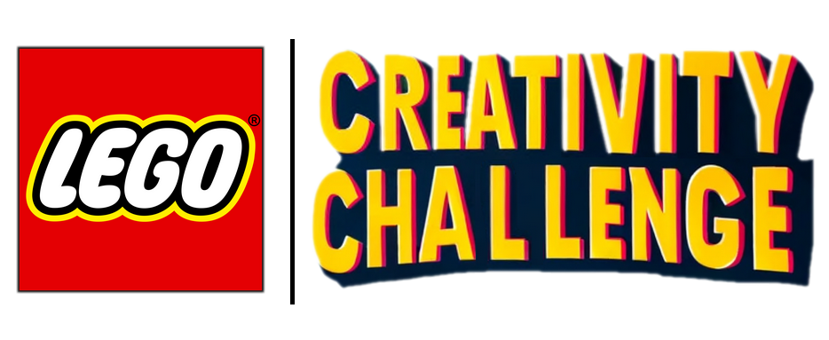

***


***

The Lego Creativity Challenge was a innovative concept we came up during the *"Innovation in Engineering"* course at DTU with my team. The goal was to find a concept that could **inspire children to become the builder of tomorrow** while engaging more in going to the several stores. 

# The idea

This concept is an ice-breaker for customers coming in stores and wanting to play with the *Pick n' Build* walls. Often this people don't know with which brick to start and where to go. By giving them some constraints on bricks to include, we're hoping that they'll be more inspired and able to build something nice that could be displayed in store or on screens.

# How does it works

The concept is simple: given the store inventory for the *Pick n' Build* dispensers, the algorithm just has to take three bricks randomly and give a certain amount of them. In the end, the consumer should have **10 mandatory bricks** of **3 different types**. 

We also choose to weight the bricks by their size (with an exponential rule). The bigger the bricks, the lesser they will appear. Thus it will be easier to include them in their build.

The build is space-constrained. It should fit inside a cube of edge 20 cm. 

# How this app is made

This app was made using React (and in Typescript) for the website and WebGL for the spinning bricks display. It uses ReactRouter for the navigation between pages. The overall architecture is a SPA (*single page application*) without any backend behind.

## How to clone it

First, clone this repository on your computer: 

```shell
git clone https://github.com/Meltwin/lego.git
```

And download all the packages you need to make it run:

```shell
yarn add
```

## How to build it

To build this website, just run the following command:

```shell
yarn build
```